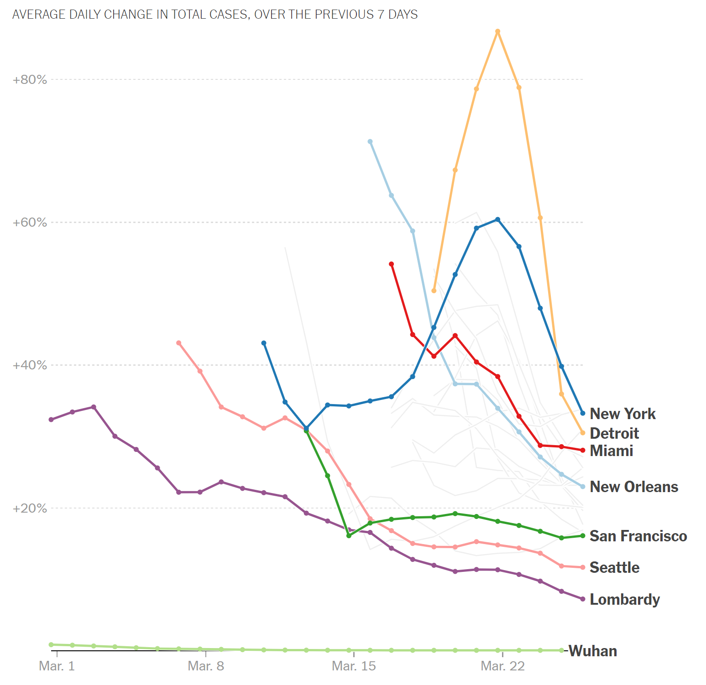
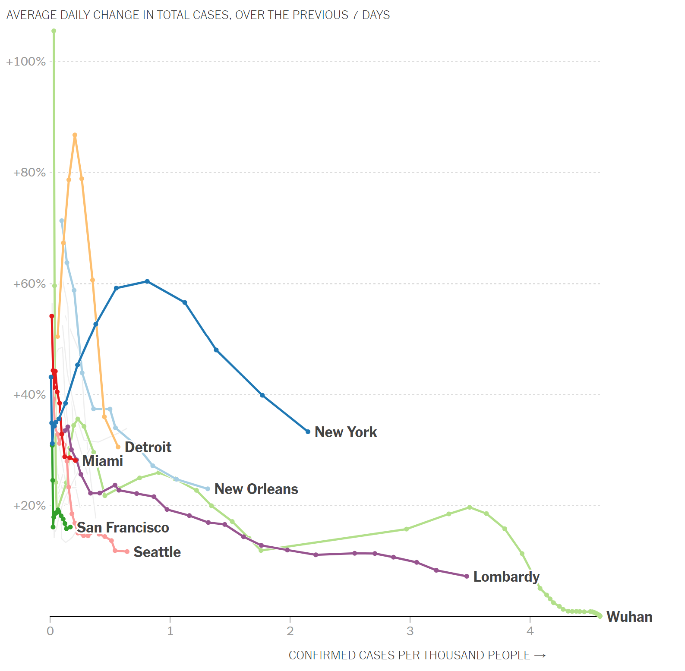

```{r setup, include=FALSE}
knitr::opts_chunk$set(
  echo = FALSE,
  message = FALSE,
  warning = FALSE
)

library(tidyverse)
library(purrr)
library(lubridate)
library(zoo)


```


```{r}
us_counties <- read_csv("https://raw.githubusercontent.com/nytimes/covid-19-data/master/us-counties.csv")

us_states <- read_csv("https://raw.githubusercontent.com/nytimes/covid-19-data/master/us-states.csv")
```

```{r}
county_population <- 
  read_csv("https://www2.census.gov/programs-surveys/popest/datasets/2010-2019/counties/totals/co-est2019-alldata.csv") %>% 
  mutate(FIPS = paste0(str_pad(STATE, width = 2, pad = "0"), 
                       str_pad(COUNTY, width = 3, pad = "0"))) %>% 
  select(FIPS, POPESTIMATE2019)


```

```{r}
us_counties_pop <-
  us_counties %>% 
  left_join(county_population, by = c("fips" = "FIPS")) 

new_york_city_pop <- 
 read_csv("https://www2.census.gov/programs-surveys/popest/datasets/2010-2019/counties/totals/co-est2019-alldata.csv") %>% 
   filter(STNAME == "New York") %>% 
   filter(CTYNAME %in% c("Kings County", "Queens County", "New York County", "Bronx County")) %>% 
   select(POPESTIMATE2019) %>% 
   sum()

# manually enter NA information for New York City, which is missing fips
us_counties_pop[which(us_counties_pop$county == "New York City"), "POPESTIMATE2019"] <- new_york_city_pop
```


```{r}
us_metroarea <-   
  us_counties_pop %>% 
  mutate(metro_area = case_when(county %in% c("Lapeer",
                                              "St. Clair",
                                              "Macomb",
                                              "Oakland",
                                              "Wayne",
                                              "Livingston") &
                                  state == "Michigan" ~ "Detroit",
                                county %in% c("Marin",
                                              "Contra Costa",
                                              "Alameda",
                                              "San Francisco",
                                              "San Mateo") &
                                  state == "California" ~ "San Francisco",
                                county %in% c("Pierce",
                                              "King",
                                              "Snohomish") &
                                  state == "Washington" ~ "Seattle",
                                (county %in% c("Suffolk",#
                                               "Nassau",#
                                               # "Queens",
                                               # "Kings",
                                               # "Bronx",
                                               "New York City",
                                               "Westchester",#
                                               "Putnam",#
                                               "Rockland",#
                                               "Richmond") &
                                   state == "New York") |
                                  (county %in% c("Bergen",
                                                 "Passaic",
                                                 "Sussex",
                                                 "Morris",
                                                 "Hunterdon",
                                                 "Somerset",
                                                 "Middlesex",
                                                 "Monmouth",
                                                 "Ocean",
                                                 "Essex",
                                                 "Hudson",
                                                 "Union") & 
                                     state == "New Jersey") |
                                  (county == "Pike" &
                                     state == "Pennsylvania") ~ "New York",
                                county %in% c("Miami-Dade",
                                              "Broward",
                                              "Palm Beach") &
                                  state == "Florida" ~ "Miami",
                                county %in% c("Jefferson",
                                              "Orleans",
                                              "Plaquemines",
                                              "St. Bernard",
                                              "St. Tammany",
                                              "St. Charles",
                                              "St. John the Baptist",
                                              "St. James") &
                                  state == "Louisiana" ~ "New Orleans",
                                TRUE ~ NA_character_)) %>% 
  filter(!is.na(metro_area)) %>% 
  group_by(metro_area, date) %>%
  summarize(cases = sum(cases, na.rm = TRUE),
            deaths = sum(deaths, na.rm = TRUE),
            population = sum(POPESTIMATE2019, na.rm = TRUE)) %>% 
  ungroup()
```


## Plot 3: Growth Rates Over Time

First, calculate "AVERAGE DAILY CHANGE IN TOTAL CASES, OVER THE PREVIOUS 7 DAYS" as

$$
\textrm{avg daily change}_t =   \frac{1}{7} \sum_{t' = t-7}^{t'} \textrm{change}_{t'}
$$
where
$$
\textrm{change}_t = \frac{\textrm{cases}_t}{\textrm{cases}_{t-1}}-1
$$

This is a very literal calculation based on the description

```{r}
plot_data <-
  us_metroarea %>% 
  group_by(metro_area) %>% 
  nest() %>% 
  mutate(data = purrr::map(data, function(df) mutate(df, daily.change = cases / lag(cases, default = NA) - 1)),
         data = purrr::map(data, function(df) mutate(df, mean.daily.change = rollapply(daily.change, list(-(0:6)), mean, align = "right", partial = TRUE)))) %>% 
  unnest() %>% 
  ungroup() %>% 
  # mutate(`Average Daily Change (Last 7 Days)` = round(roll.cases/cases/7*100,2)) %>% 
  mutate(`Average Daily Change (Last 7 Days)` = mean.daily.change) %>% 
  mutate(`Average Daily Change (Last 7 Days)` = ifelse(is.nan(`Average Daily Change (Last 7 Days)`), 0, `Average Daily Change (Last 7 Days)`)) %>% 
  rename(Name = metro_area,
         Date = date,
         Cases = cases) %>% 
  filter(Cases > 100) %>% 
  filter(between(Date, as.Date("2020-03-01"), as.Date("2020-03-26"))) # for comparison

plot_data_ends <-
  plot_data %>% 
  group_by(Name) %>% 
  top_n(1, Date) %>% 
  select(Name, `Average Daily Change (Last 7 Days)`) %>% 
  deframe()

p <-
  plot_data %>% 
  ggplot(aes(Date, `Average Daily Change (Last 7 Days)`, color = Name)) +
  geom_point() + 
  geom_line(size = 1) +
  geom_hline(yintercept = 0, color = "grey50") +
  scale_x_date(expand = c(0, 0.06),
               limits = c(as.Date("2020-03-01"), NA)) +
  scale_y_continuous(limits = c(0,1),
                     breaks = seq(0,1, by = 0.2), 
                     labels = scales::percent_format(),
                     sec.axis = sec_axis(~ .,
                                         breaks = plot_data_ends,
                                         labels = names(plot_data_ends))) +
  scale_color_brewer(palette = "Paired",
                     limits = c("New Orleans", "New York", "Wuhan", "San Francisco","Seattle",
                                "Miami", "", "Detroit", "", "Lombarday"),
                     breaks = c("Seattle", "Detroit", "New Orleans", "San Francisco",
                                "New York", "Miami")) +
  theme_minimal() +
  theme(legend.position = "none") +
  theme(axis.text.y.right = element_text(face = "bold", color = "black")) +
  labs(x = NULL, 
       y = NULL,
       subtitle = "AVERAGE DAILY CHANGE IN TOTAL CASES, OVER THE PREVIOUS 7 DAYS")


p
ggsave("average-daily-change-in-total-cases_nyt.png", p)

```


Next, calculate "AVERAGE DAILY CHANGE IN TOTAL CASES, OVER THE PREVIOUS 7 DAYS" as

$$
\textrm{avg daily change}_t =  \left( \frac{\textrm{cases}_t}{\textrm{cases}_{t-7}} \right)^{(1/7)} - 1 
$$

which is a compount daily growth rate (see [https://en.wikipedia.org/wiki/Compound_annual_growth_rate]).  

```{r}
plot_data <-
  us_metroarea %>% 
  group_by(metro_area) %>% 
  nest() %>% 
  mutate(data = purrr::map(data, function(df) mutate(df, daily.change = (cases / lag(cases, n = 7, default = NA))^(1 / 7) - 1 ))) %>% 
  unnest() %>% 
  ungroup() %>% 
  # mutate(`Average Daily Change (Last 7 Days)` = round(roll.cases/cases/7*100,2)) %>% 
  mutate(`Average Daily Change (Last 7 Days)` = daily.change) %>% 
  mutate(`Average Daily Change (Last 7 Days)` = ifelse(is.nan(`Average Daily Change (Last 7 Days)`), 0, `Average Daily Change (Last 7 Days)`)) %>% 
  rename(Name = metro_area,
         Date = date,
         Cases = cases) %>% 
  filter(Cases > 100) %>% 
  filter(between(Date, as.Date("2020-03-01"), as.Date("2020-03-26"))) # for comparison

plot_data_ends <-
  plot_data %>% 
  group_by(Name) %>% 
  top_n(1, Date) %>% 
  select(Name, `Average Daily Change (Last 7 Days)`) %>% 
  deframe()

p <-
  plot_data %>% 
  ggplot(aes(Date, `Average Daily Change (Last 7 Days)`, color = Name)) +
  geom_point() + 
  geom_line(size = 1) +
  geom_hline(yintercept = 0, color = "grey50") +
  scale_x_date(expand = c(0, 0.06),
               limits = c(as.Date("2020-03-01"), NA)) +
  scale_y_continuous(limits = c(0,1),
                     breaks = seq(0,1, by = 0.2), 
                     labels = scales::percent_format(),
                     sec.axis = sec_axis(~ .,
                                         breaks = plot_data_ends,
                                         labels = names(plot_data_ends))) +
  scale_color_brewer(palette = "Paired",
                     limits = c("New Orleans", "New York", "Wuhan", "San Francisco","Seattle",
                                "Miami", "", "Detroit", "", "Lombarday"),
                     breaks = c("Seattle", "Detroit", "New Orleans", "San Francisco",
                                "New York", "Miami")) +
  theme_minimal() +
  theme(legend.position = "none") +
  theme(axis.text.y.right = element_text(face = "bold", color = "black")) +
  labs(x = NULL, 
       y = NULL,
       subtitle = "AVERAGE DAILY CHANGE IN TOTAL CASES, OVER THE PREVIOUS 7 DAYS")

p
# ggsave("average-daily-change-in-total-cases_nyt_cdgr.png", p)
# plot_data
```

### Comparison 

From https://www.nytimes.com/interactive/2020/03/27/upshot/coronavirus-new-york-comparison.html

```{r}

```


## Plot 4: Growth Rates by Case Count


```{r}
plot_data <-
  us_metroarea %>% 
  group_by(metro_area) %>% 
  nest() %>% 
  mutate(data = purrr::map(data, function(df) mutate(df, daily.change = (cases / lag(cases, n = 7, default = NA))^(1 / 7) - 1 ))) %>% 
  unnest() %>% 
  ungroup() %>% 
  # mutate(`Average Daily Change (Last 7 Days)` = round(roll.cases/cases/7*100,2)) %>% 
  mutate(`Average Daily Change (Last 7 Days)` = daily.change) %>% 
  mutate(`Average Daily Change (Last 7 Days)` = ifelse(is.nan(`Average Daily Change (Last 7 Days)`), 0, `Average Daily Change (Last 7 Days)`)) %>% 
  mutate(`Confirmed Cases Per Thousand People` = cases / population * 1000) %>% 
  rename(Name = metro_area,
         Date = date,
         Cases = cases) %>% 
  filter(Cases > 100) %>% 
  filter(between(Date, as.Date("2020-03-01"), as.Date("2020-03-26"))) # for comparison

plot_data_ends <-
  plot_data %>%
  group_by(Name) %>%
  top_n(1, Date) %>%
  select(Name, `Confirmed Cases Per Thousand People`, `Average Daily Change (Last 7 Days)`) 

p <-
  plot_data %>% 
  ggplot(aes(`Confirmed Cases Per Thousand People`,
             `Average Daily Change (Last 7 Days)`,
             color = Name)) +
  geom_point() + 
  geom_line(size = 1) +
  geom_hline(yintercept = 0, color = "grey50") + 
  ggrepel::geom_text_repel(aes(label = Name), 
                           data = plot_data_ends,
                           color = "black",
                           face = "bold",
                           hjust = 1) +
  scale_x_continuous(limits = c(0, 4.5),
                     expand = c(0, 0.06)) +
  scale_y_continuous(limits = c(0,1),
                     breaks = seq(0,1, by = 0.2), 
                     labels = scales::percent_format()) +
  scale_color_brewer(palette = "Paired",
                     limits = c("New Orleans", "New York", "Wuhan", "San Francisco","Seattle",
                                "Miami", "", "Detroit", "", "Lombarday"),
                     breaks = c("Seattle", "Detroit", "New Orleans", "San Francisco",
                                "New York", "Miami")) +
  theme_minimal() +
  theme(legend.position = "none") +
  theme(axis.text.y.right = element_text(face = "bold", color = "black")) +
  labs(x = NULL, 
       y = NULL,
       subtitle = "AVERAGE DAILY CHANGE IN TOTAL CASES, OVER THE PREVIOUS 7 DAYS")

p
# ggsave("average-daily-change-in-total-cases_nyt_cdgr.png", p)
# plot_data
```


### Comparison 

From https://www.nytimes.com/interactive/2020/03/27/upshot/coronavirus-new-york-comparison.html

```{r}

```


## Appendix: R Code

```{r appendix, ref.label=knitr::all_labels(),echo=TRUE,eval=FALSE}
```
